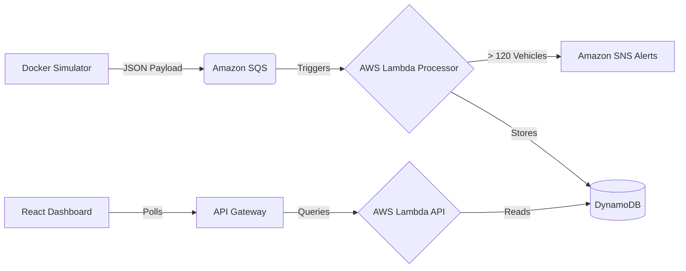

# 🚦 CloudTraffic Monitoring System

An Enterprise-grade, Event-Driven Serverless architecture designed to ingest, process, and visualize high-velocity traffic data from simulated IoT cameras in real-time.


## 🏗️ Architecture

This system follows a decoupled, highly-scalable Serverless pattern:



### Why this Architecture?
1. **Amazon SQS (Buffer):** Acts as a shock-absorber. If millions of IoT cameras transmit data simultaneously, SQS queues the data, preventing database lockups and ensuring zero data loss.
2. **AWS Lambda (Compute):** Serverless compute means zero idle costs. The processor instantly scales up based on SQS queue depth, and scales to zero when traffic stops.
3. **Amazon DynamoDB (Storage):** A NoSQL database chosen specifically for its lightning-fast write performance, which is critical for high-velocity time-series IoT data.
4. **Amazon SNS (Alerts):** Provides instant, push-based fanout messaging to notify traffic engineers via email during severe congestion events.
5. **Least-Privilege Security:** Strict IAM roles ensure that compute nodes only have the exact permissions required to read/write from specific resources.

## 🚀 Quick Start Guide

### 1. Deploy the Infrastructure (AWS)
Navigate to the `infrastructure` directory and deploy the Terraform configuration:
```bash
cd infrastructure
terraform init
terraform apply
```
*Note down the `api_endpoint` and `sqs_queue_url` provided in the outputs.*

### 2. Start the Frontend Dashboard
Update the `API_ENDPOINT` variable in `frontend/src/App.jsx` with your new Terraform output. Then start the React dev server:
```bash
cd frontend
npm install
npm run dev
```

### 3. Start the IoT Camera Simulator
Navigate to the `simulator` directory. Start the Docker container, passing in your AWS credentials and the new SQS Queue URL:
```bash
cd simulator
docker build -t cloudtraffic-simulator .
docker run -e SQS_QUEUE_URL="<YOUR_SQS_URL>" -v "$env:USERPROFILE\.aws:/root/.aws:ro" cloudtraffic-simulator
```

## 🛡️ Security Measures
- **Encryption in Transit:** All communications between microservices, the simulator, and the frontend utilize TLS 1.2+ via AWS HTTPS endpoints.
- **Encryption at Rest:** All traffic data stored in DynamoDB is encrypted using military-grade AES-256.
- **CI/CD:** GitHub Actions automatically lints the Python simulator, builds the Docker image, and validates the Terraform infrastructure on every push.
